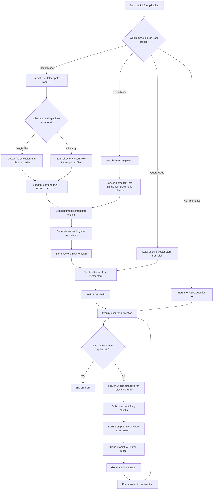
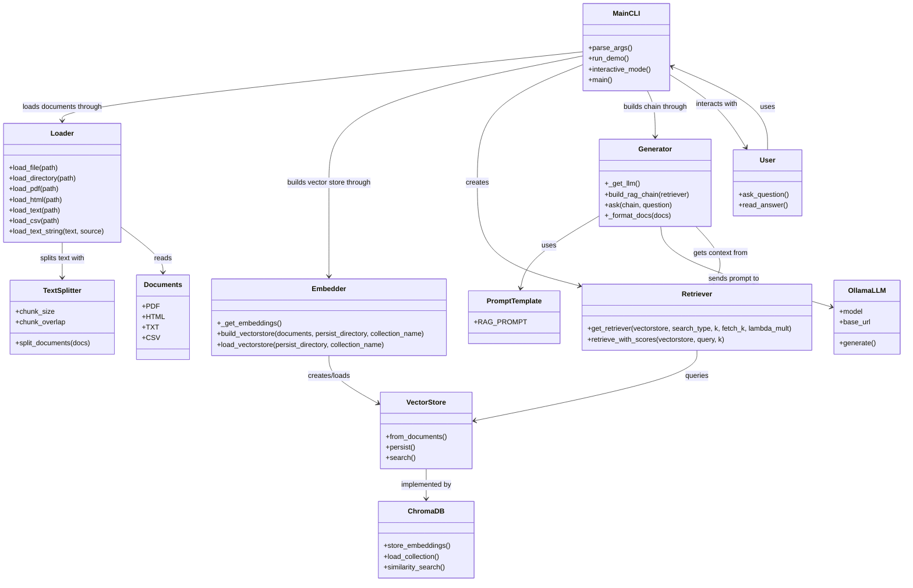
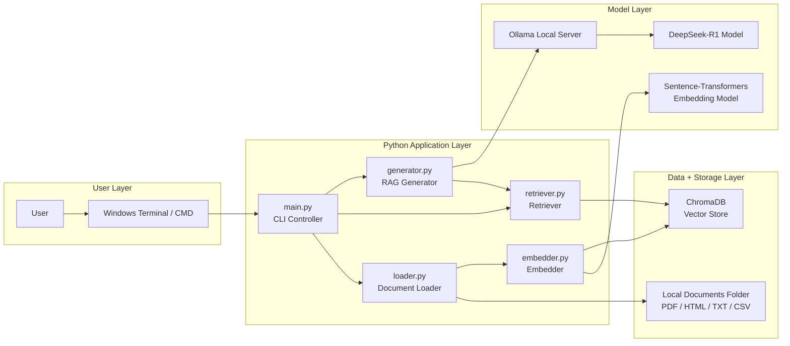

# RAG Complete Guide — Step-by-Step Beginner Setup

This README is a full beginner-friendly installation and usage guide. It explains every major step from installing Ollama to pulling a model to running the RAG application locally.

---

## 1. What you are building

You are building a local RAG application that can:
- read PDF files,
- read HTML files,
- read text files,
- read CSV files,
- convert them into searchable embeddings,
- store them in ChromaDB,
- answer questions using a local Ollama model.

---

## 2. RAG flow



---

## 3. Component structure



---

## 4. Runtime architecture



## 5. Prerequisites

## 5. Prerequisites

Before starting, make sure you have:
- Windows machine
- Python installed
- Internet connection for first-time package/model downloads
- Enough RAM/disk space for local models

---

## 6. Install Python

1. Download Python from the official Python website.
2. During installation, check **Add Python to PATH**.
3. Open CMD and verify:

```bat
python --version
```

If that does not work, try:

```bat
py --version
```

---

## 7. Install Ollama

1. Open browser and go to the official Ollama website.
2. Download the Windows installer.
3. Run the installer.
4. Finish setup.
5. Open a new CMD window.
6. Verify installation:

```bat
ollama --version
```

If that works, Ollama is installed correctly.

---

## 8. Check Ollama is working

Run:

```bat
ollama list
```

This shows models already available on your machine.

If no models are shown, that is okay. It means Ollama is installed but no model has been downloaded yet.

---

## 9. Pull your first model

To download DeepSeek-R1, run:

```bat
ollama pull deepseek-r1:8b
```

You can use another exact model tag if your machine is smaller or larger.

After download finishes, check again:

```bat
ollama list
```

You should see `deepseek-r1:8b` in the list.

---

## 10. Test the model directly in Ollama

Before using Python, test the model directly:

```bat
ollama run deepseek-r1:8b
```

Then type something simple:

```text
What is RAG?
```

If it responds, the model works.

Type `/bye` or close the session when done.

---

## 11. Create the project folder

```bat
mkdir rag-complete-guide
cd rag-complete-guide
```

---

## 12. Create a virtual environment

```bat
python -m venv .venv
```

Activate it:

```bat
.\\.venv\\Scripts\\activate.bat
```

You should now see `(.venv)` at the beginning of your prompt.

---

## 13. Upgrade pip

```bat
python -m pip install --upgrade pip
```

---

## 14. Create or update `requirements.txt`

Use this content:

```txt
langchain>=0.3.0
langchain-core>=0.3.0
langchain-community>=0.3.0
langchain-text-splitters>=0.3.0
chromadb>=0.5.0
sentence-transformers>=3.0.0
langchain-huggingface>=0.1.0
huggingface-hub>=0.24.0
transformers>=4.44.0
pypdf>=4.0.0
beautifulsoup4>=4.12.0
lxml>=5.0.0
unstructured>=0.15.0
langchain-ollama>=0.2.0
langchain-openai>=0.2.0
langchain-anthropic>=0.2.0
python-dotenv>=1.0.0
pytest>=8.0.0
```

---

## 15. Install Python dependencies

```bat
python -m pip install -r requirements.txt
```

This may take a few minutes the first time.

---

## 16. Important code fixes

### In `rag/loader.py`
Use:

```python
from langchain_text_splitters import RecursiveCharacterTextSplitter
```

### In `rag/embedder.py`
Use:

```python
from langchain_huggingface import HuggingFaceEmbeddings
```

These changes match the newer LangChain package structure.

---

## 17. Set environment variables for the model

In CMD:

```bat
set LLM_BACKEND=ollama
set LLM_MODEL=deepseek-r1:8b
```

Verify:

```bat
python -c "import os; print(os.getenv('LLM_BACKEND')); print(os.getenv('LLM_MODEL'))"
```

Expected output:

```text
ollama
deepseek-r1:8b
```

---

## 18. Run demo mode

```bat
python main.py --demo
```

This should:
1. create demo text chunks,
2. create embeddings,
3. store them in ChromaDB,
4. connect to Ollama,
5. start answering questions.

---

## 19. Run with your own documents

Put your files inside `documents/` and run:

```bat
python main.py --ingest .\\documents
```

Then either run:

```bat
python main.py
```

or ask a single question:

```bat
python main.py --query "What is the refund policy?"
```

---

## 20. Very common errors and fixes

### `ModuleNotFoundError: No module named 'langchain_core'`
Install dependencies again:

```bat
python -m pip install -r requirements.txt
```

### `ModuleNotFoundError: No module named 'langchain.text_splitter'`
Change import to:

```python
from langchain_text_splitters import RecursiveCharacterTextSplitter
```

### `ModuleNotFoundError: No module named 'sentence_transformers'`
Install:

```bat
python -m pip install sentence-transformers
```

### `ModuleNotFoundError: No module named 'langchain_ollama'`
Install:

```bat
python -m pip install langchain-ollama
```

### `ConnectError [WinError 10061]`
Ollama is not reachable.
Check:

```bat
ollama list
```

### `model 'llama3.2' not found`
Your code or environment is still pointing to the wrong model.
Set:

```bat
set LLM_MODEL=deepseek-r1:8b
```

---

## 21. Recommended beginner run sequence every time

```bat
cd C:\\Users\\abhis\\rag-complete-guide
.\\.venv\\Scripts\\activate.bat
ollama list
set LLM_BACKEND=ollama
set LLM_MODEL=deepseek-r1:8b
python main.py --demo
```

---

## 22. Learning progression

Learn the project in this order:
1. Ollama installation
2. Model pulling
3. Python environment setup
4. Document loading
5. Text chunking
6. Embeddings
7. ChromaDB
8. Retrieval
9. Prompting the LLM
10. Interactive question loop

---

## 23. Final note

If the system fails, always check these five things first:
1. Is the virtual environment activated?
2. Are the required packages installed?
3. Is Ollama installed and reachable?
4. Does `ollama list` show the model?
5. Is `LLM_MODEL` set to the exact model tag?

